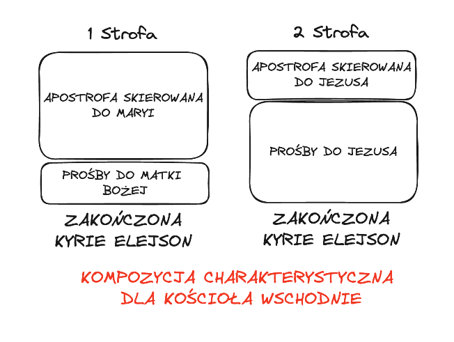

# Sprawdzian Średniowiecze 2024-02-23

- [ ] Wiadomości ze wstępu do epoki.

## Bogurodzica

1. [x] Znajomość treści 

    Teskt kierowany jest do Matki Bożej (pierwsza zwrotka), Jezus Chrystus (druga zwrotka). Jest wysyłana prośba do Matki Boskiej o zesłan ie łask ludziom. Maryja jest orędowniczką.W drugiej zwrotce podmiot zbiorowy zwraca się do niego aby za pomacą Jana Chrzciciela spełnił prośby. Proszą o wysłuchanie i napełnienie myśli a później o dobre, pobożne życie i zbawienie. Zwrotki kończą się Kyrie eleison (Panie zmiłuj się)

2. [x] Kompozycja utworu
    
3. [x] Realizacja motywu deesis ( co to jest za motyw i jak w utworze funkcjonuje)

    Deesis to słowo z języka greckiego, oznaczającego modlitwę, prośbę, orędownictwo. Syn Boży zawsze stanowił centrum sceny, Maryja i Jan Chrzciciel zajmowali miejsca po jego lewej oraz prawej stronie. 

    Motyw deesis w Bogurodzicy obecny jest w dwóch pierwszych zwrotkach. Czytamy tam uroczyste zwrócenie się do Maryi Panny w języku staropolskim, która ma być orędowniczką ludzkich modlitw do Boga. Jego zwrot ma wiec formę uroczystą, pełną oddania i czci. Dosłownie zwraca się dalej do Maryi: "Zyszczy nam, spuści nam", co oznacza: "zdobądź dla nas, ześlij nam". Prosi więc, nim jeszcze przedstawi swoją prośbę w dalszej części pieśni, o poparcie jej przez Bogurodzicę u Stwórcy.

    W pieśni motyw deesis jest klasyczny, ponieważ prócz Matki Bożej dochodzi do wymienienia Jana Chrzciciela.

4. [x] Archaizmy (co to jest archaizm, rodzaje archaizmów i przykłady z utworu)

    Archaizmy czyli zwroty, słowa, które wyszły z użycia wraz z czasem.

    Archaizmy leksykalne – dawne wyrazy, które wyszły z użycia. Najliczniejsza grupa archaizmów wchodzących w skład „Bogurodzicy”:

    - „dziela” – dla
    - „Gospodzin” – Pan, Gospodarz
    - „zbożny” – dostatni, pomyślny
    - „przebyt” – bytowanie, przebywanie
    - „bożyc” – Syn Boga
    - „jegoż” – czego, o co
    - „jąż” – którą
    - „zwolena” – wybrana

    Archaizmy fonetyczne – związane z dawną wymową określonych słów (np. udźwięczniającą):

    - „Krzciciela” – chrzciciela
    - „sławiena” – wsławiona (forma ta do Polski przybyła najprawdopodobniej z Czech)

    Archaizmy słowotwórcze – związane z praktykowanym w dawniejszych czasach sposobem tworzenia wyrazów:

    - „Bogurodzica” – Matka Boga (forma ta powstała przez stosowaną w średniowieczu formę: matka (komu?) Bogu),
    - „Bożyc” – Syn Boga (jak księżyc = syn króla)
    - Archaizmy składniowe – wiążące się z niepraktykowanym już sposobem łączenia wyrazów w zdaniach
    - „Bogiem sławiena” – przez Boga sławiona lub sławiona ze względu na Boga (którego Syna narodziła)
    - „twego dziela” – dla twego

    Archaizmy fleksyjne – wyrazy odmieniane według dawnych wzorców, przez co zawierają archaiczne końcówki:

    - „zyszczy” – pozyskaj
    - „raczy” – racz
    - „spuści” – ześlij
    - "napełń" - napełnij

## Lament świętokrzyski (Żale Matki Boskiej pod krzyżem)

1. [x] Znajomość treści

    Utwór stanowi monolog Maryi, matki Jezusa, bolejącej i lamentującej pod krzyżem. Maryja początkowo wzywa otaczających ją ludzi do współczucia, zrozumienia i współuczestnictwa w cierpieniu. Następnie ze słowami pełnymi czułości zwraca się do Syna, chcąc w ostatniej chwili Jego życia zbliżyć się do Niego i ulżyć Mu w męce. Następne strofy monologu wybuchają rozpaczą i buntem Maryi przeciw Aniołowi Gabrielowi, który zwiastował Dziewicy chwałę i radość, nie wspomniał natomiast o ogromie cierpienia, jakie będzie musiała przejść. Utwór kończy przestroga skierowana do wszystkich matek, aby modliły się do Boga o swoich synów.

2. [x] Plankt jako gatunek (cechy) i realizacja tego gatunku w utworze (do kogo i w jakim celu zwraca się Maryja).

    Plankt – utwór łączący opłakiwanie z zachęcaniem odbiorców do współuczestnictwa w cierpieniu (zwroty te określane są łacińskim terminem apostropha de luctu).

    - Częsty podział na kilka osób mówiących.

    Poczatkowo Maryja zwraca się do innych ludzi aby dołączyli do jej lamentu. Później zwraca się do anioła Gabriela, który zwiastował jej szczęście i chwałę i nie wspominał o ogromny cierpieniu jakie będzie musiała przejść

3. [x] Motyw Stabat Mater (czym jest i jak funkcjonuje w utworze)

    Stabat Mater "pojęcie odnoszące się do cierpiącej matki Jezusa Chrystusa stojącej pod krzyżem syna". Motyw ten polegał na ukazaniu płączacej matki Maryji pod krzyżem Jezusa Chrystusa. I cierpienia matki podczas obserwowania śmierci syna. 

    W "Lamencie Świętokrzyskim" Matka Boska jest **podmiotem lirycznym**, nie jest ona też adresatką modlitw przez co jest w pewnym sensie pozbawiona boskości. Pokazane też zostają słabości Maryi.

## Legenda o świętym Aleksym

1. [x] Losy Aleksego

    Opis dworu rodziców Aleksego:  Eufamijana i Aglijas mieszkali w Rzymie bogaci troszczyli się o sieroty, wdowy oraz pielgrzymów.

    W wieku 20 lat na polecenie ojca poślubił córkę cesarza, Famijanę, otrzymując błogosławienie cesarza i papieża Innocentego. W noc poślubną Aleksy oddaje pierścionek małżonce i odszedł od niej by wieść życie w czystości. Zalecił jej służbę Bogu, troskę o biednych i szacunek wobec starszych. Ona obiecuje się spełnić te prośby.

    Odejście Aleksego nastąpiło w całkowitej tajemnicy. Po nocy weselnej Aleksy zebrał tyle złota i srebra ile mógł tylko unieść wsiadł na okręt i odpłynał. Po przyjeździe do innego kraju rozdał całe majątek ubogim i przestał przyznawać się do swego pochodzenia. Wiódł bardzo pobożne i skrommne życie. Za jego przyczyną wydarzyło się wiele cudów. Pewnego razu sama Matka Boska stąpiła z obrazu i nakazała słudze wpuścić modlącego się przed kościołem Aleksego do środka. Ta nowina bardzo szybko się rozeszła do ojca Aleksego, który wysłał tam swoich ludzi, ale oni go nie rozpoznali. Nie był zadowolony ze swojej sławy więc wyjechał do Syrii, a potem wrócił do Rzymu. Wrócił na dwór swojego ojca nie dając się poznać. Powołując się na przyjaciela Aleksego prosi swojego ojca o schronienie. Spędza tam 16 lat i jest traktowany bardzo źle.

    Śmierć św. Aleksego jest bardzo dziwna, pewnego razu w Rzymie zaczynają bić wszystkie dzwony. Zastano Aleksego z listem w ręku, którą mogła otworzyć tylko jego żona Famijana. W liście była opisana świętość Aleksego i jego prawdziwa historia. Po jego śmierci następowało wiele uzdrowiem przy jego ciele co potwierdzało jego świętość.

2. [x] Cechy

    Jest skromny, pobożny, jego życie to pasmo wyrzeczeń i świadomie prowokowanych cierpień. Właśnie w nich średniowieczny asceta upatrywał sens życia. Wiara Aleksego była prosta i naiwna, całkowicie pozbawiona wątpliwości.

3. [x] Pojęcia: asceza, hagiografia

    Asceza - praktykowanie dobrowolnego **wyrzeczenia się pewnych dóbr, wartości i aktywności życiowych w celu osiągnięcia świętości**, czystości i doskonałości duchowej oraz zbawienia. 

    Hagiografia (od greckich: „hagios” – święty oraz „graphein” – pisać) - to specjalny rodzaj piśmiennictwa chrześcijańskiego, koncentrujący się na opisywaniu życiorysów świętych oraz legend z nimi związanych.

    - cechuje się bardzo wyraźną kompozycją trójdzielną.
    - opowiada historię świętego od dnia narodzin aż do śmierci. 

4. [x] Ocena postawy

    Moim zdaniem, aby roważyć, czy postawa św. Aleksego była dobrym sposobem na życie należy wziąć pod uwagę dwa apsekty postrzegania jego życia. Pierwszym z nich jest to, iż św. Aleksy chciał osiągnąć zbawienie, do którego dążył poprzez ascezę, a więc jego tryb życia polegał na ciągłym wyrzeczaniu się przyjemności. Patrząc na to z tej perspektywy, jego postawa była jak najbardziej pożądana; pobożność, skromność, znoszenie jednakowo przeciwności losu sprzyjały osiąganiu świętości. Ponadto św. Aleksy żył w czystości, opuścił rodzinę, stał się żebrakiem. Takie nędzne zycie prowadził aż 17 lat, co jest godne podziwu. Przy ocenie jego sposobu na zycie nalezy wziąć pod uwagę także to, że żył on w czasach średniowiecznych, gdzie silną pozycję miał pogląd teocentryzmu, który mocno oddziaływał na ludzi, a więc może św. Aleksy padł jego ofiarą? Dał się omamić tej ideologii? 

    Na życie św. Aleksego można spojrzeć także z drugiej strony. Ze strony osoby nie dążącej do świętości. Tu jednak jego ocena jego sposobu na zycie byłaby negatywna, gdyż udał się do Edessy, zostawiając rodzinę bez słowa, aby móc zdobyć świętość, co może być odczytane jako egoizm św. Aleksego, który myślał tylko o tym, aby się zbawić, nie patrząc na to, iż jego rodzina cierpi z powodu jego braku w domu. 

    Patrząc na sposób zycia św. Aleksego oczami osoby XXI-wieczej, uważam, że nie był on dobry, bo poświęcił to, co jest bardzo ważne w życiu - rodzinę dla swoich dążeń, ale patrząc na jego sposób zycia uwzgędniając fakt, iż chciał być zbawiony, myślę że nie powinno się go oceniać negatywnie.

## Rozmowa Mistrza Polikarpa ze Śmiercią

1. [x] Znajomość treści

    Rozmowa Mistrza Polikarpa ze Śmiercią jest najciekawszym średniowiecznym utworem polskim. Ma formę dialogu liczącego 498 wierszy. Jej anonimowy autor zaczyna od inwokacji do Boga i prośby o pomoc w napisaniu dzieła. Potem opowiada historię Mistrza Polikarpa, który prosił Boga o łaskę oglądania Śmierci. Ukazała mu się, gdy sam modlił się w kościele. Wygląd zewnętrzny Śmierci ukazany w dialogu nawiązuje do jej średniowiecznych wizerunków z tzw. Tańca śmierci. Przedstawiona jest jako rozkładający się trup kobiecy, okryty chustą. Opis jej jest realistyczny, a postać groźna i groteskowa jednocześnie. Na prośbę Mistrza Polikarpa Śmierć opowiada swe dzieje, począwszy od narodzin w raju, gdy Ewa zerwała jabłko i podała je Adamowi. Odpowiada także na jego pytanie dotyczące powszechności Śmierci, możliwości jej powstrzymania przez lekarzy, sposobów na to, by ujść jej mocy, a także roli Śmierci na Sądzie Ostatecznym. Z jej słów wynika, że ma ona moc nad wszystkimi ludźmi, szczególnie nad grzesznikami, bez względu na ich zamożność i status społeczny. Jej działalność można jednak uznać za pożyteczną, gdyż porządkuje normy moralne, zgładzając grzeszników, wśród których wyróżnieni są mordercy, okrutnicy, rozpustne kobiety, niesprawiedliwi sędziowie, a także inni łamiący śluby, żyjący w pijaństwie i rozwiązłości. Rozmowa w wersji polskiej jest urwana. Jej koniec znamy z przeróbki ruskiej. Mistrz pytał o Sąd Ostateczny, a Śmierć poradziła mu, by służył Bogu, bo gdy przyjdzie po raz drugi, to go pozbawi życia.

    W dialogu widoczne są elementy satyry, a jego szczególny związek z życiem objawia się tam, gdzie występują rysy obyczajowe. Przedstawienie postaci jest barwne, żywe - nawet Śmierć jest ruchliwa i pełna energii - i plastyczne, a urywki satyryczne pełne humoru. Cały utwór, poprzez ukazanie tzw. czterech rzeczy ostatecznych (śmierć, Sąd Ostateczny, niebo, piekło) nabiera przy tym cech moralizatorskich.

2. [x] Pojęcia: memento mori, danse macabre, ars moriendi (realizacja tych haseł w utworze)

    - Motyw memento mori zaobserwować możemy w utworze „Rozmowy mistrza Polikarpa ze Śmiercią”, gdzie śmierć opowiada Polikarpowi o swej potędze, wobec której wszyscy ludzie są sobie równi. Przypomina ona, że każdy niezależnie od swego majątku, stanowiska czy wiary spotka się z nią osobiście. Śmierć nie oszczędza nikogo.

    - Bardzo popularny w średniowieczu motyw danse macabre przedstawia upersonifikowaną Śmierć, zagarniająca do tańca przedstawicieli wszystkich stanów i wieków, co symbolizuje równość przed nią i bezsens dbania o wartości materialne, gdyż są one dla śmierci bezwartościowe. Śmierć mówi o tym, że każdego czeka śmierć.

    - Śmierć opowiada Polikarpowi o swej potędze, wobec której wszyscy ludzie niezależnie od pochodzenia, swego majątku i stanowiska staja się sobie równi, a tym samym ukazuje marność i przemijalność doczesnego życia. Działalność śmierci w utworze „Rozmowa mistrza Polikarpa ze Śmiercią” można uznać za pożyteczna, gdyż porządkuje ona normy moralne, przede wszystkim zgadzając grzeszników.

3. [ ] Groza i komizm w obrazie śmierci. Omów zagadnienie na podstawie znanych Ci fragmentów Rozmowy Mistrza Polikarpa ze Śmiercią.

    - Grozą w tym utworze jest wizerunek śmierć, szkieleta z resztkami ciała, które gnije. Odpada jej nos w trakcie rozmowy.

    - Komizm jest widoczny poprzez śmierć ruchliwa i pełna energii. Sam tekst jest pełen satyry i śmieszych dialogów

## Kwiatki świętego Franciszka

1. [x] Relacje z Bogiem i światem. Omów zagadnienie na podstawie znanych Ci fragmentów Kwiatków świętego Franciszka z Asyżu.

    - Franciszkanie uważali wszystko co stworzył Bóg za świetę. Dlatego traktowali zwierzęta na równi z ludźmi. Św. Franciszek jest patronem ekologów

    - Postawa franciszkańska to okazywanie pokory wobec wszechpotężnego i wspaniałego Boga, jako stwórcy, umiłowanie wszystkiego, co żywe, okazywanie dobroci i niesienie pomocy potrzebującym, życie w harmonii z naturą. Franciszkanizm to koncepcja wiary radosnej.

2. [x] Franciszkanizm

    Kwiatki... to będący adaptacją łacińskiego tekstu zbiór legend, ukazujący życie i nauczanie św. Franciszka oraz jego uczniów. Tekst pochodzi z drugiej polowy XIV wieku, a sporządzony został przez anonimowego Włocha z Toskanii. Cechuje je wdzięk, prostota, naiwność języka oraz swoista atmosfera. Całość przesiąknięta jest cudownością i nadzieją. Tytuł nawiązuje do tzw. języka kwiatów, mogących symbolizować różne przymioty, pojęcia etyczne itp. Trzeba go tłumaczyć jako cnoty franciszkańskie. Treść poszczególnych epizodów ukazuje cnoty św. Franciszka i jego towarzyszy, jako całość składają się na franciszkański wzorzec religijny.

## Pieśń o Rolandzie

1. [x] Cechy idealnego rycerza (czy Roland je posiada)

    - honor
    - męstwo.
    - szlachetność
    - sprawiedliwość
    - troska o sławę
    - stanowczość
    - nieugiętość woli i ducha.

    Roland był tak nieugięty, że nawet w przegranej pozycji nie wycofał się. Czym zabił cały swój oddział, nad którym miał dowództwo.

2. [x] Omówienie sceny śmierci i jej symboliki

    Śmierć Rolanda- motyw ars moriendi Jest to wzór heroicznej śmierci rycerza, który do końca jest wierny Bogu i ojczyźnie. Rycerz nie chce, aby jego miecz dostał się w ręce wrogów- pogan, bo w mieczu były relikwie świętych. Przed śmiercią prosi Boga o wybaczenie win. 

    Samo miejsce (góra) ma symbolizować Golgotę. Zaś drzewo, pod którym umiera - Krzyż Święty.

3. [x] Znajomość treści

     Hiszpanii toczą się walki między cesarzem Karolem Wielkim a zamieszkującymi Hiszpanię Saracenami. Po latach wypełnionych kolejnymi bitwami na horyzoncie rysuje się nadzieja na zakończenie konfliktu. Karolowi do zwycięstwa brakuje jedynie zdobycia Saragossy i pokonania jego króla – Marsyla. Ten jednak nie zamierzał się tak łatwo poddać. Przyjął więc radę swojego doradcy – Blankandryna, który przekonał go, że jedyny sposób to udawanie, że jest gotowy przejść na chrześcijaństwo. W takim przypadku Marsyl zostanie co prawda wasalem Karola, ale nie będzie mu groziło niebezpieczeństwo podboju. Był to ruch bardzo niebezpieczny, ale władca Saragossy zdecydował się spróbować tego rozwiązania. Wysłał do Karola posłów, którzy mieli obwieścić cesarzowi propozycję króla Saragossy.

    W tym czasie Karol świętował właśnie zdobycie Korbowy (in. Kordoby). Karol nie uznawał kompromisów. Zwyciężeni mieli tylko jeden wybór: chrzest albo śmierć (z tego Marsyl też zdawał sobie sprawę). Karol jednak z uwagą przyjął propozycję posłów Marsyla. Następnego dnia dyskutował o niej ze swoimi rycerzami. Roland był zdecydowanie przeciw, bo pamiętał, że Marsyl już raz ich oszukał. Większość jednak przyjęła optykę Ganelona, który sugerował rozejm. To właśnie jego Karol wysłał z poselstwem do Marsyla. Zanim ruszył, powierzył cesarzowi syn Baldwina w opiekę.

    Ganelon najpierw rozmawiał z Blankandrynem, który sprowokował go do ujawnienia swojej niechęci do Rolanda. Kiedy Ganelon przekazał informację Marsylowi, że Karol jest gotów przystać na jego propozycję, ale warunkiem jest oczywiście chrzest, a po nim podzieli Hiszpanię na pół między Marsyla a Rolanda, król Saragossy wpadł w szał.

    Podczas narady, w której wziął udział również Ganelon, ustalono, że podjęta zostanie próba zabójstwa Rolanda. Marsyl był bowiem przekonany, że bez niego Karol odstąpi od dalszych walk. Oprócz Rolanda miał zginąć nie mniej ważny Oliwier, a także 12 innych wyborowych rycerzy Karola. Ganelon, skłonny do zdrady za cenę wyeliminowania swojego przeciwnika, podpowiedział, że warto przekazać Karolowi rzekomych zakładników, którzy w odpowiednim momencie zaatakują tylną straż. Ganelon miał sprawić, aby znalazł się w niej Roland.

    Ganelon skłamał więc przed obliczem Karola, przekazując mu same fałszywe informacje. Kiedy Ganelon zapewniał cesarza o pozytywnych rokowaniach, wojska Marsyla właśnie otaczały francuskie szeregi. Zgodnie z planem, zdrajca zadbał również o to, by Roland i Oliwier znaleźli się w tylnej straży. Rycerze Karola czuli jednak, że coś jest nie tak, podejrzewali, że za wszystkim kryje się jakiś podstęp. Kiedy Oliwier dostrzegł hiszpańskie wojska, dał Rolandowi znak do odwrotu, ten jednak zbyt mocno cenił swój honor, aby uciec z pola walki.

    Roland skutecznie poradził sobie z siostrzeńcem Marsyla, który marzył o tym, by go zabić. Młodzieniec zginął pod Rosenwald. Niestety sytuacja Francuzów, otoczonych przez wojska hiszpańskie, była trudna. Roland bronił się, jak tylko mógł. Marsylowi jednak udało się jeszcze raz zebrać rozgromionych rycerzy i ruszyć do ataku, w którym zginęła większość francuskich wojsk. Arcybiskup kazał zadąć Rolandowi w róg, Karol natychmiast odczytał ten znak, nakazując zemstę na wrogach. Pojmany od razu został także zdrajca Ganelon.

    Roland starł się bezpośrednio z Marsylem. Odciął mu prawą pięść. Hiszpanie musieli uciekać. Oliwier zabił wuja Marsyla, Maganisa. Ten jednak także ugodził go śmiertelnie. Roland nie mógł przeboleć straty Oliwiera, niestety konał obok niego także arcybiskup. Roland, mdlejąc kilka razy od odniesionych ran, wszedł jednak na wzgórze. Tutaj stoczył walkę z jeszcze jednym Hiszpanem, aby następnie ułożyć się twarzą w stronę wroga i umrzeć z modlitwą na ustach. Po jego duszę zeszli św. Gabriel i św. Michał.

    Karol nie był gotowy pogodzić się z tym, co się stało. Ruszył więc do ataku i rozgromił wszystkich Hiszpanów. Marsyl uciekł do Saragossy, gdzie do walki o Hiszpanię z Karolem namówił emira Baliganta. Ten zachęcony obietnicą władzy na Hiszpanią, wypowiedział Karolowi wojnę. Do Karola wieści te dotarły, kiedy zarządzał pochówek swoich najlepszych rycerzy. Serca Rolanda, Oliwiera i arcybiskupa Turpina zostały złożone w marmurowej trumnie. Ciała wywieziono do Francji. 

    Karol bez większych problemów rozgromił armię emira, a także zabił jego samego. Marsyl na wieść o kolejnej przegranej także zmarł. Karol wszedł do Saragossy, Hiszpanów w końcu ochrzczono, a na miejscu cesarz pozostawił część wojsk. Sam wrócił do Francji na pogrzeb swoich rycerzy. Karę śmierci poniósł Ganelon i jego krewni.

    Powoli nastawał spokój. Szybko jednak został on przerwany. Do Karola ponownie przyszedł bowiem św. Gabriel. Poinformował cesarza, że pomocy potrzebuje oblegany przez pogan król Wiwian. Karol nie wahając się, ruszył w drogę.

4. [x] Ocena postawy bohatera

    Roland był tak nieugięty, że nawet w przegranej pozycji nie wycofał się. Czym zabił cały swój oddział, nad którym miał dowództwo.

## Dzieje Tristana i Izoldy

1. [x] Znajomość losów (wg notatki z podręcznika)

    Tristan to siostrzeniec i wasal króla Kornwalii, Marka. Król chce poślubić właścicielkę złotego włosa i wysyła na poszukiwania Tristana. Rycerz znajduje Izoldę Złotowłosą i płyną do Kornwalii. W czasie podróży główni bohaterowie wypijają przypadkowo napój miłosny, przygotowany przez matkę królewny dla niej i dla króla.

    Od tej chwili Tristan i Izolda zakochują się w sobie. Mimo to odbywają się zaślubiny Złotowłosej z królem. Kochankowie spotykają się potajemnie. Baronowie donoszą władcy na zakochanych i karzeł Frocyn szykuje podstęp, który pozwoli ich schwytać. Tristan i Izolda zostają skazani na stos, ale cudem udaje im się uciec do puszczy. Po pewnym czasie znajduje ich leśniczy i informuje o tym króla, który idzie do kryjówki kochanków. Gdy widzi ich śpiących, rozdzielonych nagim mieczem, ogarnia go litość. Pozwala wrócić Izoldzie na dwór. Tristan żegna ukochaną i przybywa do Bretanii. Żeni się z Izoldą o Białych Dłoniach, cały czas cierpiąc i rozmyślając o Izoldzie Złotowłosej. Gdy zostaje w walce zraniony zatrutą lancą, prosi swojego przyjaciela, aby pomógł mu zobaczyć ostatni raz ukochaną. Kaherdyn płynie więc po Izoldę Złotowłosą. Gdy zbliżają się już do brzegu, zazdrosna żona mówi Tristanowi, że statek ma czarną flagę (co miało znaczyć, że nie ma na pokładzie Izoldy Złotowłosej). Tristan umiera w rozpaczy, tak samo zaraz po przybyciu jego ukochana. Po śmierci kochanków z grobu Tristana wyrasta krzak głogu i łączy go z grobem Izoldy. To symbol wiecznej, prawdziwej i niezniszczalnej miłości.

2. [x] Tragizm Tristana

    Tragizm bohaterów polegał na tym, że czegokolwiek by nie uczynili, pozostaliby nieszczęśliwi. Tristan jako dobry rycerz winien postępować w zgodzie z wolą władcy, a zatem nie mógł związać się z Izoldą. Kobieta z kolei, chcąc pozostać oddaną żoną, musiała zrezygnować z romansu z ukochanym i trwać przy królu mimo braku uczuć do niego. Obydwie postaci starały się postępować zgodnie ze średniowiecznymi wzorcami osobowymi, jednak nie przyniosło im to spełnienia ani szczęścia.

3. [x] Ocena postawy bohatera
<LeftMouse>
    Tristan i Izolda, znani jako "kochankowie wszech czasów", to para średniowiecznych kochanków, których związek charakteryzuje potężna namiętność, wywołana magicznym napojem, przynosząca jednak cierpienie i rozpacz zamiast szczęścia. Naruszenie porządku moralnego wynikało z faktu, że Izolda była przeznaczona na żonę króla Marka, a Tristan, pierwotnie wzór rycerza, zmienił się pod wpływem miłości do niej. Oboje świadomi byli nieakceptowanej miłości, próbowali ją ukrywać, a potem uciekli.

    Czytelnicy odczuwają różne emocje, podziwiając Tristana za odwagę i Izoldę za spryt w obliczu sądu. Podobne historie często występują obecnie w telenowelach, przyciągając młodych pragnących doświadczyć piękna miłości. Autorka, choć romantyczna, zdaje sobie sprawę, że życie nie zawsze odzwierciedla filmy.

    Nie życzyłaby nikomu miłości, która przynosi chwilowe szczęście, ale równocześnie stałe cierpienie. Autorka uważa, że miłość powinna inspirować i przynosić radość, nie tylko krótkotrwałe szczęście i trudy.

## Gall Anonim „Kronika polska”

1. [ ] Znajomość polskich kronik
2. [ ] Wiadomości na temat utworu (według notatki z zeszytu)
3. [ ] Cechy idealnego władcy na podstawie omawianych fragmentów

